<div align="center">

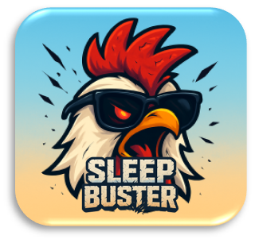

# Sleep Buster 🤖⏰
### みんなの朝を『つなぐ』アプリ

[](https://github.com/Saisei2004/WILDCARD)

</div>

> **Hackit 2025 WildC@rd チーム開発プロジェクト**  
> 発表日: 2025年8月4日 (一般参加チーム)  
> **🏆 最優秀賞受賞 🏆**
> 
> 設定した時間に起きられなかった友人や仲間を、  
> 遠隔操作のロボットで「物理的にたたき起こす」  
> **最強のAndroidアラームアプリケーション**

---

## このドキュメントについて

このドキュメントは、金沢工業大学のプロジェクト同士の交流を目的とした学内ハッカソン「Hackit（ハックイット）」で開発されたプロジェクトのREADMEです。  

**参考リンク：**

- [Hackit2025 公式サイト](https://hackit-website.vercel.app/)
- [Hackit2025 Notion](https://kit-hackit.notion.site/Hackit-Connect-2025-23219ee67e9b80f89e89e4b762bbb0f0)

---

## 🏆 プロジェクト概要

**金沢工業大学 学内ハッカソン「Hackit 2025」にて、全8チームが参加する激戦の中、ユニークなアイデアとハードウェア・ソフトウェアの高度な連携が評価され、見事『最優秀賞』を受賞しました！**

**Sleep Buster**は単なる目覚ましアプリではありません。「みんなの朝を『つなぐ』アプリ」というコンセプトのもと、友人同士で楽しく、そして確実に朝の時間を守ることができる革新的なアラームアプリケーションです。

### 🎯 最強の起床システム
- **問題**: 一人だと二度寝してしまい、なかなか起きられない
- **解決策**: 友達が遠隔操作でロボット「バスタ君」を動かして物理的に起こす
- **特徴**: リアルタイム映像確認 + ロボット制御 + みんなで楽しむ起床体験

---

## 🎬 デモ動画

### **システム実演動画**
📹 **[system_demo.mp4](docs/videos/system_demo.mp4)** - バスタ君の遠隔操作とWebRTC映像通信の実演

> 📝 **動画について**
> - **内容**: ロボットの遠隔操作とWebRTCリアルタイム映像通信の動作確認
> - **状態**: UI改良前のデバッグ版での動作テスト
> - **確認項目**: 
>   - バスタ君の前後左右移動
>   - ハンマー機構の動作
>   - WebRTCによるリアルタイム映像配信
>   - Androidアプリからの制御信号送信

> 💡 **動画ファイルは `docs/videos/` フォルダに保存されています**
> - `system_demo.mp4` - システム全体の動作実演（デバッグ版UI）

---

## 🤖 バスタ君詳細

このプロジェクトの物理的なコンポーネントが、バスターロボットの「**バスタ君**」です。

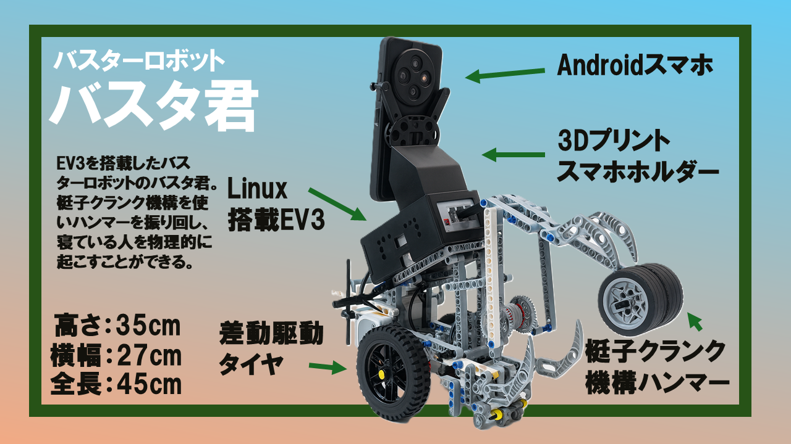

### **主な機能**
- 🚗 **差動駆動タイヤによる移動** - 十字キーで前後左右に自在に操作
- 🔨 **梃子クランク機構のハンマー** - 寝ている人を物理的に起こす
- 🔊 **警告音システム** - EV3からビープ音で音による警告

### **特徴的な機構**

#### **🔨 ハンマー機構**

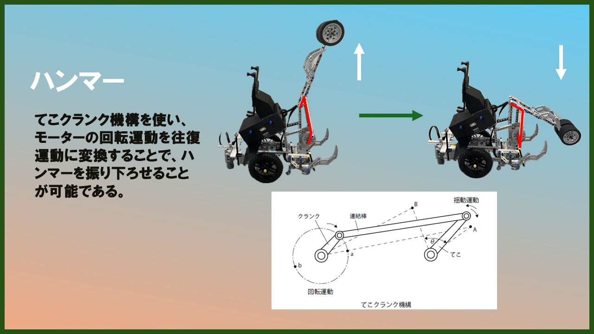

- **設計**: てこクランク機構により効率的な打撃を実現
- **動作**: モーターの回転運動をハンマーの上下運動に変換
- **効果**: 適切な力で確実に起床を促進

#### **📱 スマホスタンド**

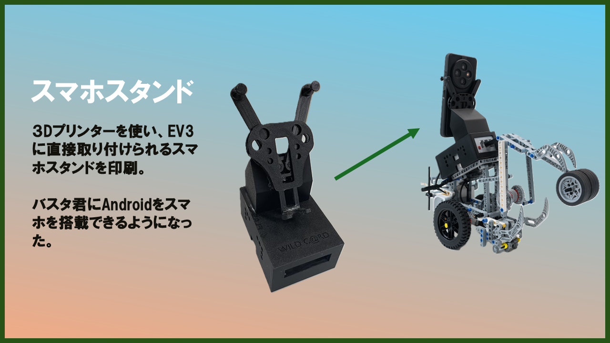

- **3Dプリンター製**: プロジェクト専用に設計された固定システム
- **安定性**: 移動中もスマートフォンをしっかりと保持
- **カメラアングル**: WebRTC映像配信に最適な角度を確保

### **技術構成**
- **本体**: Linux搭載のLEGO MINDSTORMS EV3
- **パーツ**: 3Dプリントされたスマホホルダーなど
- **操作**: Androidスマートフォンから遠隔操作

### **サイズ**
- **高さ**: 35cm
- **横幅**: 27cm  
- **全長**: 45cm

---

## 📱 アプリ使用の流れ

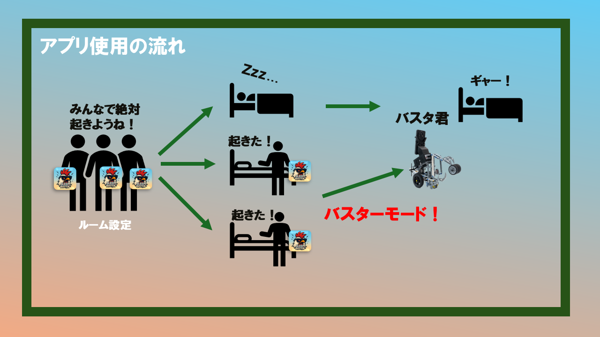

### **1️⃣ ルーム設定モード**

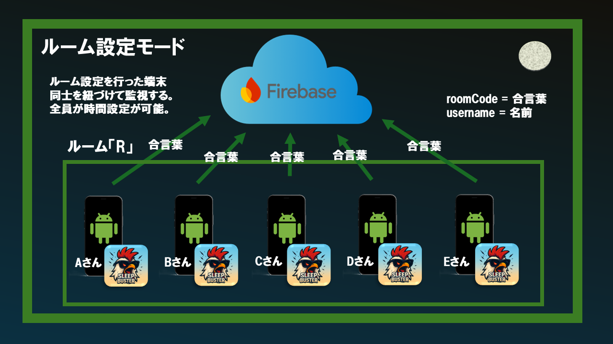

#### **参加方法**
1. ホーム画面でユーザー名を入力
2. 「ルームに入る」をタップ
3. 共通の「合言葉」を入力して特定のルームに参加

#### **監視システム**
- ルームに参加した端末同士は、**Firebaseデータベース**を介して紐付け
- お互いの起床ステータスをリアルタイムで監視
- ルーム内の参加者は誰でも起床時間を設定・変更可能

### **2️⃣ アラームモード**

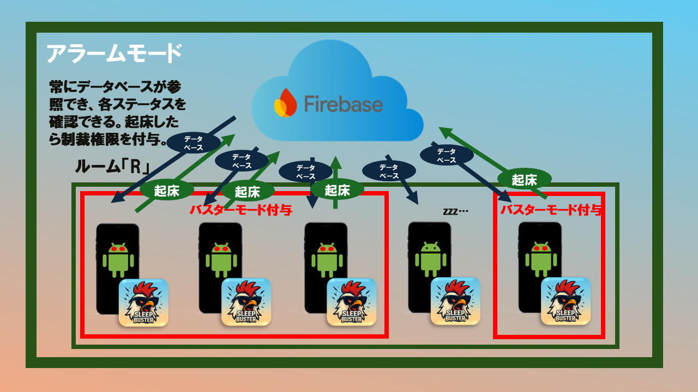

1. **設定時間になるとアラームが鳴る**
2. **ユーザーが「起きたボタン」を押す**
3. **ステータスが「起床」に変更**
4. **バスター（お仕置き）モードの権限が付与**

### **3️⃣ バスターモード**

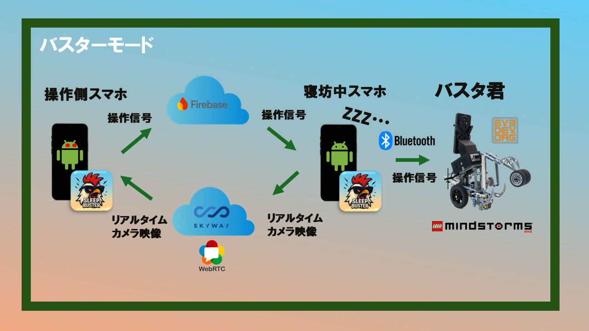

#### **発動条件**
ルーム内にまだ起きていない参加者がいる場合、起床済みのユーザーは「**バスターモード**」を発動できます。

#### **遠隔操作機能**

**📹 映像確認**
- **WebRTC & SkyWay**を利用
- 寝坊している人のスマホカメラからリアルタイムで部屋の様子を確認

**🎮 ロボット操作**
- **移動**: 十字キーで「バスタ君」を前後左右に操作
- **攻撃**: 「お仕置きボタン」でハンマーを振り下ろし
- **警告音**: 「音ボタン」でEV3からビープ音

これらの操作信号は、**Firebase**や**Bluetooth**経由でロボットに送信されます。

---

## 🛠️ 技術スタック

### **フロントエンド**
-  **Kotlin** - メイン開発言語
-  **Jetpack Compose** - モダンUIフレームワーク
-  **Material Design 3** - デザインシステム

### **バックエンド・通信**
-  **Firebase** (Firestore + Auth) - リアルタイムデータベース・状態管理
-  **SkyWay WebRTC** - P2P映像通信
-  **Bluetooth** - ロボット制御通信

### **ハードウェア**
-  **LEGO MINDSTORMS EV3** - Linux搭載ロボット本体
-  **ev3dev2** - EV3制御ライブラリ
-  **3Dプリント部品** - スマホホルダー等

---

## 📁 プロジェクト構造

```
WILDCARD/
├── app/                          # Sleep Buster Androidアプリ
│   ├── src/main/java/com/example/wildcard/
│   │   ├── ui/                   # UI層 (Jetpack Compose)
│   │   │   ├── registration/     # ルーム参加画面
│   │   │   ├── dashboard/        # メイン画面・アラーム
│   │   │   ├── mission/          # 起床ミッション
│   │   │   └── remotecontrol/    # バスターモード・遠隔操作
│   │   ├── service/              # サービス層
│   │   │   ├── firebase/         # Firebase連携
│   │   │   ├── webrtc/           # WebRTC映像通信
│   │   │   └── ev3/              # バスタ君制御
│   │   ├── domain/               # ビジネスロジック
│   │   └── data/                 # データモデル
├── docs/                         # ドキュメント・画像
│   ├── images/                   # README用画像
│   ├── videos/                   # システム実演動画
│   └── SystemSpecification.md   # 詳細技術仕様書
├── ev3src/                       # バスタ君制御プログラム
│   └── ev3Action.py              # EV3メイン制御スクリプト
└── pcServer/                     # PCサーバー (開発・デバッグ用)
    └── pcServer.py               # Flask HTTPサーバー
```

---

## 🚀 セットアップ・実行方法

### **必要な環境**
- **Android Studio** (最新版)
- **Android SDK** (API 24-35)
- **LEGO MINDSTORMS EV3** (ev3dev2 Linux環境)
- **Firebase プロジェクト**
- **SkyWay アカウント**

### **� API設定 (必須)**

#### **1. Firebase設定**
1. Firebase Consoleで新しいプロジェクトを作成
2. `app/google-services.json` ファイルを以下のプレースホルダーを実際の値に置き換えて設定：
```json
{
  "project_info": {
    "project_number": "YOUR_PROJECT_NUMBER_HERE",
    "project_id": "YOUR_PROJECT_ID_HERE", 
    "storage_bucket": "YOUR_PROJECT_ID_HERE.firebasestorage.app"
  },
  "client": [
    {
      "client_info": {
        "mobilesdk_app_id": "YOUR_MOBILE_SDK_APP_ID_HERE",
        "android_client_info": {
          "package_name": "com.example.wildcard"
        }
      },
      "oauth_client": [],
      "api_key": [
        {
          "current_key": "YOUR_FIREBASE_API_KEY_HERE"
        }
      ]
    }
  ]
}
```

**📝 設定値の取得方法:**
- Firebase Console → プロジェクト設定 → 全般タブから各値を取得
- `YOUR_PROJECT_NUMBER_HERE` → プロジェクト番号
- `YOUR_PROJECT_ID_HERE` → プロジェクトID
- `YOUR_MOBILE_SDK_APP_ID_HERE` → アプリID
- `YOUR_FIREBASE_API_KEY_HERE` → ウェブAPIキー

#### **2. SkyWay WebRTC設定**
1. SkyWayコンソールでアプリケーションを作成
2. `app/src/main/java/com/example/wildcard/utils/Constants.kt` を以下のプレースホルダーを実際の値に置き換えて設定：
```kotlin
// SkyWay WebRTC設定
const val SKYWAY_APP_ID = "YOUR_SKYWAY_APP_ID_HERE"
const val SKYWAY_SECRET_KEY = "YOUR_SKYWAY_SECRET_KEY_HERE"
```

**📝 設定値の取得方法:**
- SkyWayコンソール → アプリケーション作成 → 認証情報から取得
- `YOUR_SKYWAY_APP_ID_HERE` → アプリケーションID
- `YOUR_SKYWAY_SECRET_KEY_HERE` → シークレットキー

#### **3. EV3 Bluetooth設定**
1. EV3のBluetoothを有効にし、MACアドレスを確認
2. `Constants.kt` で以下のプレースホルダーを実際の値に置き換えて設定：
```kotlin
// EV3 Bluetooth関連
const val EV3_MAC_ADDRESS = "YOUR_EV3_MAC_ADDRESS_HERE"
```

**📝 設定値の取得方法:**
- EV3本体 → Settings → Bluetooth → About から確認
- `YOUR_EV3_MAC_ADDRESS_HERE` → EV3のMACアドレス（例: 00:16:53:42:2B:99）

### **�📱 Sleep Buster アプリのビルド**

```bash
# リポジトリクローン
git clone https://github.com/Saisei2004/WILDCARD.git
cd WILDCARD

# Android Studioでプロジェクトを開く
# File > Open > WILDCARDフォルダを選択

# 上記のAPI設定を完了後、ビルド・実行
# Android Studio上でRun/Debug
```

⚠️ **重要**: 上記のAPI設定を完了してからビルドを実行してください。設定が不完全な場合、アプリケーションは正常に動作しません。

### **🤖 バスタ君セットアップ**

```bash
# EV3にev3dev2 Linux環境をインストール
# microSDカードにev3dev2イメージを書き込み

# バスタ君にSSH接続
ssh robot@[BUSTER_IP_ADDRESS]

# 制御プログラム転送・実行
scp ev3src/ev3Action.py robot@[BUSTER_IP_ADDRESS]:/home/robot/
ssh robot@[BUSTER_IP_ADDRESS] "python3 ev3Action.py"
```

---

## 🎮 完全な利用ガイド

### **Step 1: ルーム参加**

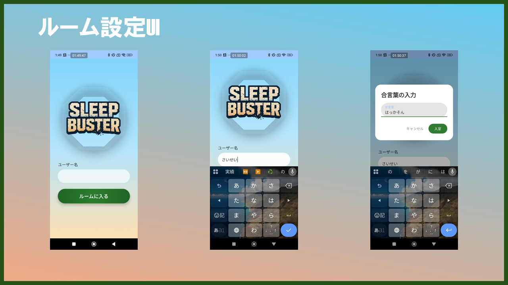

1. Sleep Busterアプリを起動
2. ユーザー名を入力
3. 「ルームに入る」で合言葉入力
4. 友達と同じルームに参加完了

### **Step 2: 起床時間設定**

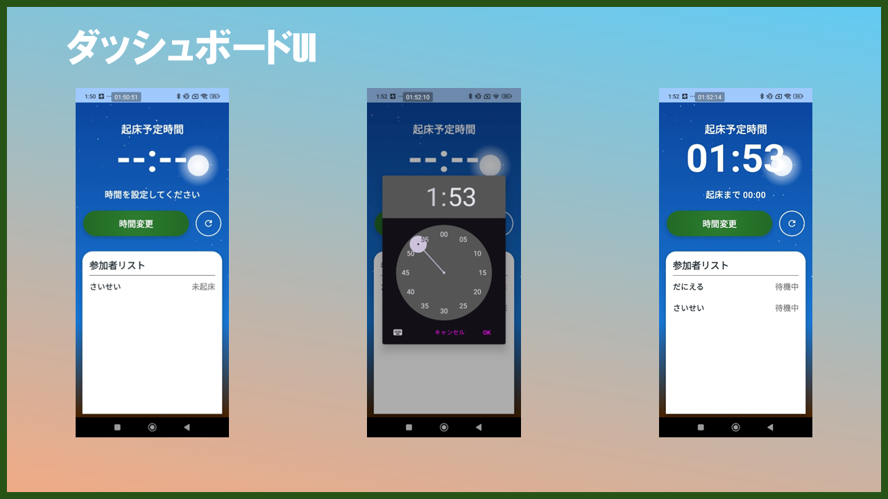

1. ダッシュボードで起床時間を設定
2. ルームメンバー全員に自動共有
3. カウントダウン開始

### **Step 3: 起床ミッション**

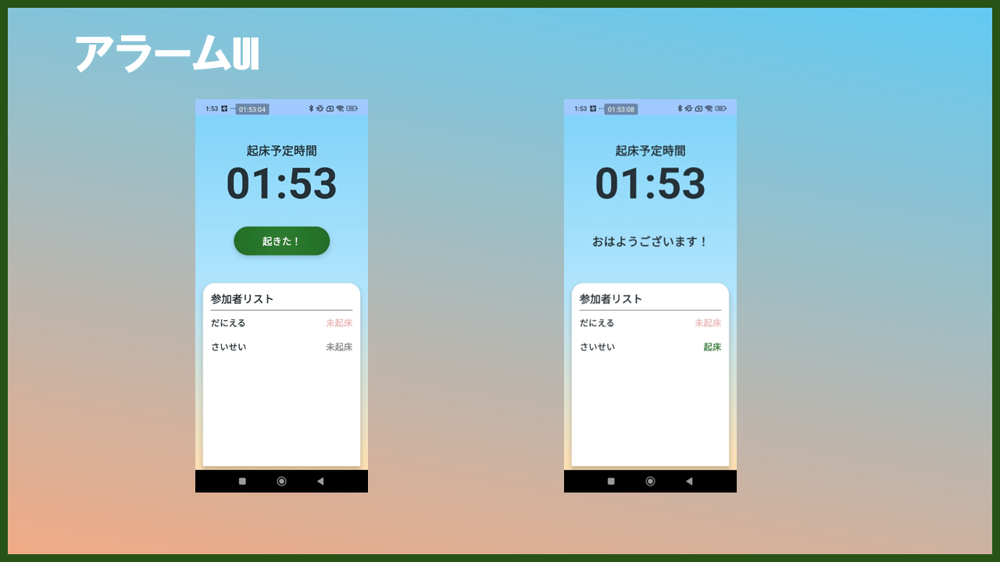

1. 設定時間にアラーム音開始
2. 「起きたボタン」をタップで起床完了
3. ステータスが起床に変更

### **Step 4: バスターモード発動**

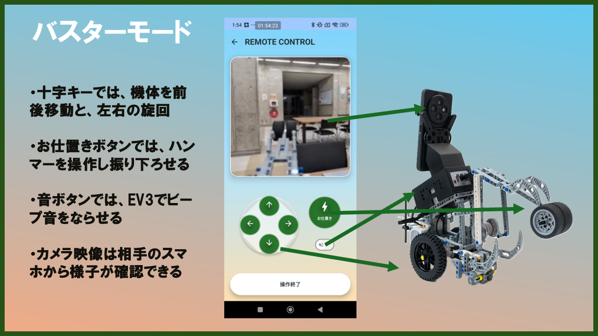

1. 寝坊した人のカメラ映像が自動配信開始
2. 起床済みメンバーがバスターモード画面へ
3. リアルタイム映像を見ながらバスタ君を遠隔操作

---

## 📊 システム通信フロー

### **主要な通信パターン**
1. **Firebase Firestore** - ルーム状態・起床ステータスのリアルタイム同期
2. **SkyWay WebRTC** - 寝坊者のカメラ映像をP2P配信
3. **Bluetooth/HTTP → TCP** - Android → バスタ君制御コマンド送信

---

## 🏆 Hackit 2025 での成果

### **チーム WildC@rd**

**金沢工業大学 学内ハッカソン「Hackit 2025」にて、計8チームが参加する中、見事最優秀賞を受賞しました！**

### **開発成果**
- 🏅 **最優秀賞を受賞** - Hackit 2025で優れたアイデアと技術力が評価
- 📅 **開発期間**: 3日間集中開発
- 🎯 **完動デモ**: ハッカソンで実際に動作するプロトタイプを披露
- 🏗️ **拡張可能設計**: 将来機能追加に対応した堅牢なアーキテクチャ
- 🤖 **ハード・ソフト連携**: AndroidアプリとEV3ロボットの完全統合

### **技術的ハイライト**
- ✅ **リアルタイム映像通信** - WebRTCによる低遅延P2P配信
- ✅ **多端末状態同期** - Firebaseによる瞬時ステータス共有
- ✅ **ロボット遠隔制御** - Android → EV3のシームレス操作
- ✅ **MVVM + Repository Pattern** - 保守性の高い設計

---

## 🎯 今後の展開

### **近期実装予定**
- 👁️ **ML Kit顔検出** - 目を開け続ける高度な起床ミッション
- 📷 **カメラプレビュー** - ミッション画面でのリアルタイム映像表示
- 🔊 **音声通話機能** - WebRTC音声通信

### **将来展望**
- 🧮 **多様なミッション** - 計算問題、早歩き、ゲーム要素
- 📈 **起床パターン分析** - AIによる個人最適化アラーム
- 📱 **iOS版開発** - クロスプラットフォーム展開
- 🤖 **バスタ君 2.0** - より高度なロボット機能

---

## 📋 技術仕様・ライセンス

### **オープンソースライセンス**
- 主要Androidライブラリ: **Apache 2.0**
- Firebase: **Google利用規約準拠**
- SkyWay: **利用規約準拠**

### **主要依存関係**
```gradle
// 主要ライブラリ
implementation 'androidx.compose.ui:ui:1.6.8'
implementation 'com.google.firebase:firebase-firestore:34.0.0'
implementation 'io.skyway:core:3.0.2'
implementation 'androidx.camera:camera-camera2:1.3.4'
```

---

## 📞 お問い合わせ・詳細情報

### **プロジェクトリポジトリ**
- 🔗 **GitHub**: [https://github.com/Saisei2004/WILDCARD](https://github.com/Saisei2004/WILDCARD)

### **詳細ドキュメント**
- 📄 **システム仕様書**: [SystemSpecification.md](https://github.com/Saisei2004/WILDCARD/blob/main/docs/SystemSpecification.md)
- 🤖 **バスタ君制御仕様**: [ev3src/ev3Action.py](./ev3src/ev3Action.py)
- 🏗️ **プロジェクト構造**: システム仕様書 第2章参照

### **デモ・プレゼンテーション**
- 🎬 **システム実演動画**: [docs/videos/system_demo.mp4](./docs/videos/system_demo.mp4) - ロボット遠隔操作とWebRTC通信の動作確認
- 📄 **プレゼンテーション資料**: システム仕様書に詳細情報を記載
- 🎯 **確認済み動作**: 
  - バスタ君の差動駆動による移動制御
  - ハンマー機構の遠隔作動
  - WebRTCリアルタイム映像配信
  - Androidアプリからの制御コマンド送信
- ⚠️ **注意**: デモ動画はUI改良前のデバッグ版での動作テストです

---

## 🎉 まとめ

**Sleep Buster** は「みんなの朝を『つなぐ』アプリ」として、従来の目覚ましアプリの概念を覆す革新的なソリューションです。

**バスターロボット「バスタ君」**と連携することで、物理的で確実な起床体験を提供し、友人同士の絆を深めながら楽しく朝の時間を守ることができます。

Hackit 2025で3日間という短期間で完成させたこのプロジェクトは、ハードウェアとソフトウェアの完全統合、リアルタイム通信技術、そしてユニークなユーザー体験の融合を実現し、**見事最優秀賞を受賞**という輝かしい成果を収めました。

この成功は、チーム一丸となって取り組んだ創意工夫と技術への情熱の結晶です。**Sleep Buster**は今後も進化を続け、より多くの人々の朝を変えていきます。

---

**🏆 Hackit 2025 WildC@rd チーム開発**  
**最優秀賞受賞 - 最強のAndroidアラームアプリケーション Sleep Buster**  
*朝起きられないすべての人のために*


---

## � 技術詳細・システム仕様

### **詳細技術仕様**
技術スタック、アーキテクチャ、API仕様、セットアップ方法などの詳細情報は、以下のシステム仕様書をご参照ください。

� **[Sleep Buster システム仕様書](https://github.com/Saisei2004/WILDCARD/blob/main/docs/SystemSpecification.md)**

### **主要章構成**
- **第1章**: システム概要
- **第2章**: システム構成とアーキテクチャ  
- **第3章**: 技術スタック詳細
- **第4章**: Androidアプリケーション仕様
- **第5章**: Firebase連携・リアルタイムデータ管理
- **第6章**: WebRTC映像通信システム
- **第7章**: EV3ロボット制御システム
- **第8章**: PCサーバー (開発・デバッグ環境)
- **第9章**: セキュリティとプライバシー保護
- **第10章**: パフォーマンス最適化
- **第11章**: エラーハンドリング・例外処理
- **第12章**: テスト仕様・品質保証
- **第13章**: デプロイメント・運用
- **第14章**: 保守・メンテナンス
- **第15章**: 将来の拡張性・発展計画

### **クイックスタート**
```bash
# リポジトリクローン
git clone https://github.com/Saisei2004/WILDCARD.git
cd WILDCARD

# 詳細なセットアップ手順は、システム仕様書第13章を参照
```

---
