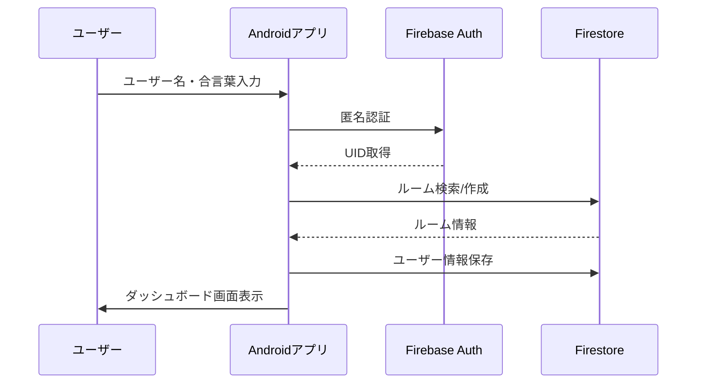
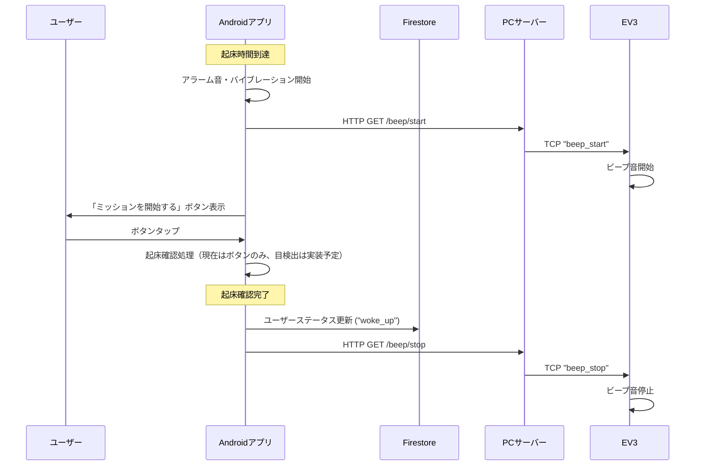
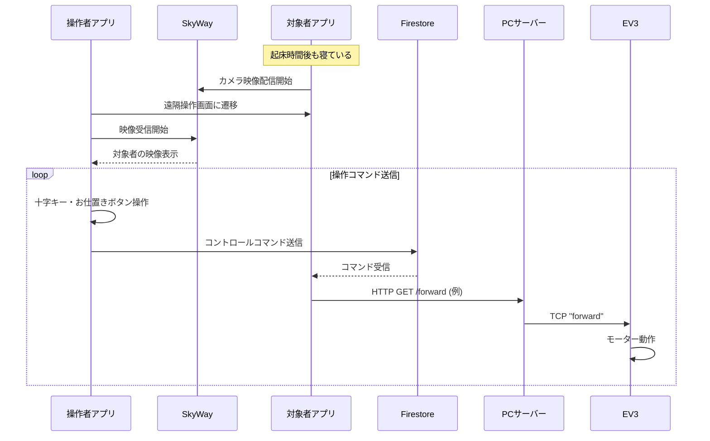
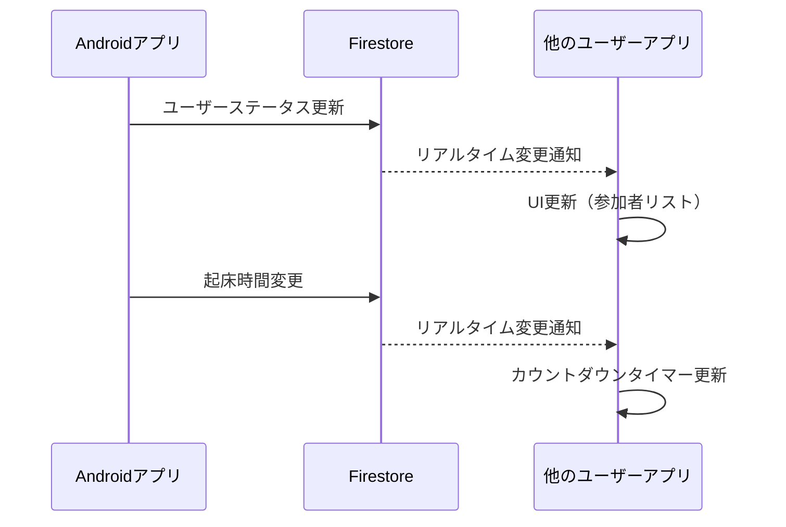

# SLEEP BASTAR システム仕様書

---

## 1. アプリ概要

本アプリは、複数人のグループで起床時間を設定し、時間通りに起きることを促すソーシャルな目覚ましアプリです。起床ミッションに成功しないと、他のメンバーからLEGO MINDSTORMS EV3（以下、EV3）を遠隔操作されて「お仕置き」を受けるというユニークな体験を提供します。

**現在の実装状況:**
- 起床確認は「ミッション開始」ボタンのタップで完了
- カメラを使った目検出機能は実装予定段階
- EV3遠隔操作とWebRTC映像通信は実装済み

### 1.1. システム全体アーキテクチャ

本システムは以下の4つのコンポーネントで構成されています：

1. **Androidアプリ** - メインのユーザーインターフェース
2. **Firebase** - クラウドデータベース及びリアルタイム通信基盤
3. **PCサーバー** - EV3との通信を仲介するローカルサーバー（開発・デバッグ用）
4. **EV3ロボット** - 物理的なアクション（アラーム、動作、お仕置き）を実行

---

## 2. ターゲット顧客と課題

### 2.1. ターゲット顧客

- **一人暮らしで朝起きるのが苦手な学生や社会人**
  - 何度連絡されても起きられず、友人に迷惑をかけた経験がある人
  - 遠隔地に住んでいる友人や家族と、朝の時間を共有し、楽しくコミュニケーションを取りたい人々
  - 既存の目覚ましアプリに飽きてしまい、新しい刺激やモチベーションを求めているユーザー

### 2.2. 顧客の課題（ニーズ）

- **単独では二度寝してしまい、強い意志がないと起きられない**
- **眠りが深く、友人からの電話では起きられない**
- **朝の目覚めが孤独で、一日の始まりに憂鬱さを感じる**
- **アラームを止めても意識がはっきりせず、活動を開始するまでに時間がかかる**
- **友人や家族と「一緒に頑張る」という連帯感が欲しい**

---

## 3. システム技術スタック

### 3.1. Androidアプリケーション

| 技術分野 | 使用技術 | バージョン | 用途 |
|---------|---------|-----------|------|
| **フレームワーク** | Android SDK | API 24-35 | アプリ開発基盤 |
| **言語** | Kotlin | 2.2.0 | メインプログラミング言語 |
| **UI** | Jetpack Compose | 1.6.8 | モダンUIフレームワーク |
| **アーキテクチャ** | MVVM + Repository Pattern | - | アーキテクチャパターン |
| **非同期処理** | Kotlin Coroutines | 1.8.1 | 非同期・並行処理 |
| **ナビゲーション** | Navigation Compose | 2.7.7 | 画面遷移管理 |
| **データベース** | Firebase Firestore | 34.0.0 | NoSQL クラウドデータベース |
| **認証** | Firebase Auth (匿名認証) | 34.0.0 | ユーザー認証 |
| **WebRTC通信** | SkyWay SDK | 3.0.2 | P2P映像通信 |
| **カメラ** | CameraX | 1.3.4 | カメラ映像取得 |
| **画像認識** | ML Kit Face Detection | 16.1.6 | 顔検出・目の認識（実装予定） |
| **画像処理** | Coil | 2.6.0 | 画像表示・キャッシュ |
| **デザイン** | Material Design 3 | 1.3.2 | Googleデザインシステム |

### 3.2. バックエンド（Firebase）

| サービス | 用途 | 詳細 |
|---------|------|------|
| **Cloud Firestore** | データ保存 | ルーム情報、ユーザー情報、コマンド情報 |
| **Firebase Auth** | 認証 | 匿名認証によるユーザー識別 |
| **Realtime Database** | リアルタイム通信 | ルーム状態変更の即座反映 |

### 3.3. PCサーバー（開発・デバッグ用）

| 技術 | バージョン | 用途 |
|------|-----------|------|
| **Flask** | - | HTTPサーバーフレームワーク |
| **Python** | 3.x | スクリプト言語 |
| **Socket** | - | TCP通信（EV3との通信） |

### 3.4. EV3ロボット

| 技術 | 用途 |
|------|------|
| **ev3dev2** | EV3制御ライブラリ |
| **Python** | EV3プログラミング言語 |
| **Socket Server** | Android・PCサーバーからの制御コマンド受信 |
| **Threading** | 並行処理（音・モーター制御） |

---

## 4. プロジェクト構造

### 4.1. 全体ディレクトリ構造

```
WILDCARD/
├── app/                                    # Androidアプリケーション
│   ├── build.gradle.kts                   # アプリレベルビルド設定
│   ├── google-services.json              # Firebase設定ファイル
│   ├── proguard-rules.pro                # ProGuard設定
│   └── src/
│       ├── androidTest/                   # インストルメンテーションテスト
│       ├── main/
│       │   ├── AndroidManifest.xml       # アプリマニフェスト
│       │   ├── java/com/example/wildcard/
│       │   │   ├── MainActivity.kt       # メインアクティビティ
│       │   │   ├── data/                 # データ層
│       │   │   │   ├── FirebaseRepository.kt
│       │   │   │   └── model/            # データモデル
│       │   │   ├── domain/               # ドメイン層
│       │   │   │   └── managers/         # ビジネスロジック管理
│       │   │   ├── service/              # サービス層
│       │   │   │   ├── bluetooth/        # Bluetooth通信
│       │   │   │   ├── ev3/              # EV3制御
│       │   │   │   ├── firebase/         # Firebase操作
│       │   │   │   ├── imagerecognition/ # 画像認識
│       │   │   │   └── webrtc/           # WebRTC通信
│       │   │   ├── ui/                   # UI層
│       │   │   │   ├── dashboard/        # ダッシュボード画面
│       │   │   │   ├── mission/          # ミッション画面
│       │   │   │   ├── navigation/       # ナビゲーション
│       │   │   │   ├── registration/     # 登録画面
│       │   │   │   ├── remotecontrol/    # 遠隔操作画面
│       │   │   │   ├── screens/          # 共通画面
│       │   │   │   └── theme/            # テーマ設定
│       │   │   └── utils/                # ユーティリティ
│       │   │       └── Constants.kt      # 定数定義
│       │   └── res/                      # Androidリソース
│       │       ├── drawable/             # 画像リソース
│       │       ├── mipmap-*/             # アプリアイコン
│       │       ├── raw/                  # 音声ファイル
│       │       ├── values/               # 文字列・色・テーマ
│       │       └── xml/                  # XML設定
│       └── test/                         # ユニットテスト
├── build.gradle.kts                      # プロジェクトレベルビルド設定
├── settings.gradle.kts                   # Gradleプロジェクト設定
├── gradle.properties                     # Gradleプロパティ
├── gradle/                               # Gradleラッパー設定
│   ├── libs.versions.toml               # 依存関係バージョン管理
│   └── wrapper/
├── ev3src/                               # EV3プログラム
│   └── ev3Action.py                     # EV3制御メインプログラム
├── pcServer/                             # PCサーバー（開発用）
│   └── pcServer.py                      # Flask HTTPサーバー
├── local.properties                      # ローカル環境設定
├── google-services.json                  # Firebase設定（ルート）
├── README.md                            # プロジェクト説明
└── SystemSpecification.md                # 本仕様書
```

### 4.2. Androidアプリ詳細構造

#### 4.2.1. アーキテクチャ階層

```
UI Layer (Jetpack Compose)
├── Screens & ViewModels
├── Navigation
└── Theme/Design System

Domain Layer
├── Managers (Business Logic)
├── Use Cases
└── Repository Interfaces

Data Layer
├── Repository Implementations
├── Data Sources (Firebase, Local)
└── Models/Entities

Service Layer
├── External API Communications
├── Hardware Integrations
└── Platform-specific Services
```

#### 4.2.2. 主要ファイル説明

| ディレクトリ/ファイル | 用途 | 主要技術 |
|---------------------|------|----------|
| **`MainActivity.kt`** | アプリのエントリーポイント | Activity, Jetpack Compose |
| **`ui/dashboard/`** | ダッシュボード画面実装 | Compose, ViewModel, StateFlow |
| **`ui/registration/`** | ユーザー登録・ルーム参加 | Compose, Navigation |
| **`ui/mission/`** | 起床ミッション機能 | 起床確認ボタン（目検出は実装予定） |
| **`ui/remotecontrol/`** | EV3遠隔操作UI | WebRTC, Compose |
| **`service/firebase/`** | Firebase連携サービス | Firestore, Auth |
| **`service/webrtc/`** | WebRTC通信管理 | SkyWay SDK |
| **`service/ev3/`** | EV3制御インターフェース | HTTP Client |
| **`domain/managers/`** | ビジネスロジック層 | Repository Pattern |
| **`data/model/`** | データモデル定義 | Data Classes |
| **`utils/Constants.kt`** | アプリ全体定数 | Object定義 |

---

## 5. システム実装詳細

### 5.1. Androidアプリの主要クラス構成

#### 5.1.1. UI層（Jetpack Compose）

- **`UserRegistrationScreen`** - ユーザー登録・ルーム参加画面
- **`DashboardScreen`** - 待機画面・ダッシュボード
- **`MissionScreen`** - 起床ミッション画面
- **`RemoteControlScreen`** - EV3遠隔操作画面

#### 5.1.2. ViewModel層

- **`HomeViewModel`** - ユーザー登録ロジック
- **`DashboardViewModel`** - ダッシュボード状態管理・アラーム制御
- **`RemoteControlViewModel`** - WebRTC通信・遠隔操作コマンド管理

#### 5.1.3. ドメイン層（Manager）

- **`RoomManager`** - ルーム作成・参加・状態更新
- **`MissionManager`** - 起床ミッション（起床確認ボタン）管理
- **`PunishmentManager`** - お仕置き機能（WebRTC + 遠隔操作）

#### 5.1.4. サービス層

- **`FirebaseService`** - Firebase Firestore操作
- **`CallManager`** - SkyWay WebRTC通信管理
- **`BluetoothService`** - Bluetooth通信（実装中）
- **`Ev3Controller`** - HTTP経由でのEV3制御
- **`ImageRecognitionService`** - ML Kit顔検出（実装予定）

#### 5.1.5. データ層

- **`FirebaseRepository`** - Firestoreデータアクセス
- **`User`** - ユーザーデータモデル
- **`Room`** - ルームデータモデル
- **`ControlCommand`** - EV3操作コマンドモデル

### 5.2. Firebase Firestore データ構造

#### 5.2.1. コレクション設計

**`rooms` コレクション**
```json
{
  "ROOM_CODE_001": {
    "roomCode": "ROOM_CODE_001",
    "wakeupTime": 1692556800000,
    "createdAt": 1692470400000
  }
}
```

**`users` コレクション**
```json
{
  "USER_UID_001": {
    "uid": "USER_UID_001",
    "username": "ユーザー1",
    "roomId": "ROOM_CODE_001",
    "status": "waiting", // "waiting", "mission", "woke_up"
    "lastSeen": 1692556740000
  }
}
```

**`commands` コレクション**
```json
{
  "target_user_id": {
    "senderId": "sender_uid",
    "direction": "forward", // "forward", "backward", "left", "right", "stop"
    "action": "hammer_strike", // "none", "hammer_strike"
    "sound": "alarm" // "none", "alarm"
  }
}
```

### 5.3. WebRTC通信（SkyWay）実装

#### 5.3.1. 映像配信側（お仕置き対象ユーザー）

```kotlin
// DashboardViewModel.kt - 朝の時間になったら自動で映像配信開始
private fun startPublishing() {
    val userId = FirebaseAuth.getInstance().currentUser?.uid ?: return
    if (callManager == null) return
    viewModelScope.launch {
        try {
            val roomName = "control_$userId"  // 実際の実装では適切なルーム名生成ロジックを使用
            val success = callManager.startPublishing(roomName)
            if (success) _isPublishing.value = true
        } catch (_: Exception) {
            // no-op
        }
    }
}
```

#### 5.3.2. 映像受信側（お仕置き実行ユーザー）

```kotlin
// RemoteControlViewModel.kt - ターゲットユーザーの映像を受信
fun startViewing() {
    viewModelScope.launch {
        val roomName = "control_$targetUserId"  // 実際の実装では適切なルーム名生成ロジックを使用
        callManager.startViewing(roomName)
    }
}
```

### 5.4. EV3制御システム

#### 5.4.1. PCサーバー（Flask）

PCサーバーはHTTPリクエストを受信し、EV3へのTCP通信に変換します：

```python
# pcServer.py
@app.route("/forward")
def forward_route():
    send_to_ev3("forward")
    return "OK"

def send_to_ev3(message):
    try:
        with socket.create_connection((EV3_HOST, EV3_PORT), timeout=2) as sock:
            sock.sendall(message.encode())
            print("[OK] Sent:", message)
    except Exception as e:
        print("[ERROR] EV3送信失敗:", e)
```

#### 5.4.2. EV3制御プログラム

EV3では複数の機能を並行実行：

```python
# ev3Action.py
# ビープ音制御
def beep_loop():
    while True:
        if state["beeping"]:
            sound.tone([(440, 500)])
        time.sleep(0.1)

# モーター制御
def motor_loop():
    while True:
        if state["left_speed"] == 0:
            motor_left.stop(stop_action="brake")
        else:
            motor_left.run_forever(speed_sp=state["left_speed"])
        time.sleep(0.05)
```

---

## 6. システム通信フロー

### 6.1. ユーザー登録・ルーム参加フロー



### 6.2. アラーム・起床ミッションフロー



### 6.3. お仕置き（遠隔操作）フロー



### 6.4. Firebase Realtime Updates



---

## 7. データモデル設計

### 7.1. Userモデル

```kotlin
data class User(
    val uid: String = "",           // Firebase認証ID
    val username: String = "",      // ユーザー設定名
    val roomId: String = "",        // 参加ルームID（合言葉）
    val status: String = "waiting", // ユーザー状態
    val lastSeen: Long = System.currentTimeMillis() // 最終アクティブ時刻
)
```

**ユーザー状態の種類:**
- `waiting` - 起床時間待機中
- `mission` - 起床ミッション実行中
- `woke_up` - 起床完了

### 7.2. Roomモデル

```kotlin
data class Room(
    val roomCode: String = "",      // ルーム合言葉（DocumentID）
    val wakeupTime: Long = 0L,      // 起床時間（Unix時間）
    val createdAt: Long = System.currentTimeMillis() // ルーム作成時間
)
```

### 7.3. ControlCommandモデル

```kotlin
data class ControlCommand(
    val senderId: String = "",      // 操作実行者のUID
    val direction: String = "stop", // 移動方向指示
    val action: String = "none",    // アクション指示
    val sound: String = "none"      // 音声指示
)
```

**移動方向の種類:**
- `forward` - 前進
- `backward` - 後退
- `left` - 左旋回
- `right` - 右旋回
- `stop` - 停止

**アクションの種類:**
- `hammer_strike` - ハンマー動作
- `none` - アクションなし

**音声の種類:**
- `alarm` - アラーム音
- `none` - 音声なし

---

## 8. API・エンドポイント仕様

### 8.1. PCサーバーエンドポイント

| エンドポイント | HTTPメソッド | EV3コマンド | 説明 |
|--------------|-------------|------------|------|
| `/beep/start` | GET | beep_start | ビープ音開始 |
| `/beep/stop` | GET | beep_stop | ビープ音停止 |
| `/motor/start` | GET | motor_start | 左モーター開始 |
| `/motor/stop` | GET | motor_stop | 左モーター停止 |
| `/forward` | GET | forward | 前進（左750/右950回転） |
| `/backward` | GET | backward | 後退（両輪-250回転） |
| `/left` | GET | left | 左旋回（左-250/右250回転） |
| `/right` | GET | right | 右旋回（左250/右-250回転） |
| `/stop` | GET | stop | 全モーター停止 |
| `/hammer/start` | GET | hammer_start | ハンマー動作開始（900回転） |
| `/hammer/stop` | GET | hammer_stop | ハンマー動作停止 |

### 8.2. EV3ソケットコマンド

EV3はTCPソケット（設定済みポート）で以下のコマンドを受信：

```python
# ビープ音制御
"beep_start" -> state["beeping"] = True
"beep_stop" -> state["beeping"] = False

# 差動駆動制御
"forward" -> left_speed = 750, right_speed = 950
"backward" -> left_speed = -250, right_speed = -250
"left" -> left_speed = -250, right_speed = 250
"right" -> left_speed = 250, right_speed = -250
"stop" -> left_speed = 0, right_speed = 0

# ハンマー制御
"hammer_start" -> hammer_speed = 900
"hammer_stop" -> hammer_speed = 0
```

---

## 9. 主要機能の技術実装

### 9.1. リアルタイム状態同期

**Firebase Firestore Snapshot Listener**を使用：

```kotlin
fun listenToUsersInRoom(roomId: String): Flow<List<User>> = callbackFlow {
    val query = usersCollection.whereEqualTo("roomId", roomId)
    val listener = query.addSnapshotListener { snapshots, e ->
        if (e != null) {
            close(e)
            return@addSnapshotListener
        }
        val users = snapshots?.mapNotNull { it.toObject(User::class.java) } ?: emptyList()
        trySend(users)
    }
    awaitClose { listener.remove() }
}
```

### 9.2. 顔検出・目の開閉認識（実装予定）

**ML Kit Face Detection API**を使用予定：

```kotlin
class ImageRecognitionService {
    fun verifyEyesOpen(duration: Long): Boolean {
        // TODO: ML Kitによる顔検出実装
        // TODO: 目の開閉状態の継続時間監視
        // TODO: 10秒間の成功判定
        // 現在は起床確認ボタンのみで判定
        return false // 実装予定
    }
}
```

**現在の実装状況:**
- 起床ミッション画面は存在するが、カメラプレビューは表示されていない
- 起床確認は「ミッションクリア」ボタンのタップのみで実行
- ML Kit顔検出機能は今後実装予定

### 9.3. WebRTC P2P映像通信

**SkyWay SDK**を使用したOne-Way映像配信：

```kotlin
class CallManager(private val applicationContext: Context) {
    suspend fun startPublishing(roomName: String): Boolean {
        // カメラデバイス取得
        val device = CameraSource.getBackCameras(applicationContext).firstOrNull()
        CameraSource.startCapturing(applicationContext, device, cameraOption)
        localVideoStream = CameraSource.createStream()
        
        // P2Pルーム作成・参加
        room = P2PRoom.findOrCreate(name = roomName)
        localRoomMember = room?.join(memberInit)
        
        // 映像公開
        localVideoStream?.let { stream ->
            localRoomMember?.publish(stream)
        }
    }
}
```

### 9.4. EV3遠隔操作コマンド

**HTTP→TCP変換方式**：

```kotlin
// Android側
class Ev3Controller(private val serverIp: String = "[PCサーバーIP]") {
    fun sendRequest(endpoint: String) {
        thread {
            try {
                val url = URL("$serverUrl$endpoint")
                val conn = url.openConnection() as HttpURLConnection
                conn.requestMethod = "GET"
                conn.connect()
            } catch (e: Exception) {
                Log.e("EV3_DEBUG", "Error: $e")
            }
        }
    }
}
```

---

## 10. アプリケーション設定詳細

### 10.1. アプリケーション基本情報

| 項目 | 値 | 説明 |
|------|-----|------|
| **アプリ表示名** | Sleep Buster | ユーザーに表示されるアプリ名 |
| **パッケージ名** | com.example.wildcard | Android識別用パッケージ名 |
| **バージョンコード** | 1 | 内部バージョン管理用 |
| **バージョン名** | 1.0 | ユーザー向けバージョン表示 |
| **最小SDK** | API 24 (Android 7.0) | サポート最小Android版本 |
| **対象SDK** | API 35 (Android 15) | 最適化対象Android版本 |

### 10.2. Firebase設定

| 項目 | 値 |
|------|-----|
| **Project ID** | [設定済み] |
| **Storage Bucket** | [設定済み] |
| **Application ID** | [設定済み] |

### 10.3. SkyWay設定

| 項目 | 値 |
|------|-----|
| **App ID** | [設定済み] |
| **Secret Key** | [設定済み] |

### 10.4. EV3ハードウェア設定

| 項目 | 値 | 説明 |
|------|-----|------|
| **EV3 IP Address** | [設定済み] | ローカルネットワーク上のEV3アドレス |
| **EV3 MAC Address** | [設定済み] | Bluetooth接続用MACアドレス |
| **TCP Port** | [設定済み] | Socket通信用ポート |
| **Output A** | 左モーター | 差動駆動用左タイヤ |
| **Output B** | 右モーター | 差動駆動用右タイヤ |
| **Output C** | ハンマーモーター | お仕置き用ハンマー機構 |

---

## 11. セキュリティ・権限設定

### 11.1. 認証・認可

- **Firebase Anonymous Authentication**による一意ユーザー識別
- **ルーム合言葉**による簡易アクセス制御
- **WebRTC P2P通信**により映像がサーバーを経由しない

### 11.2. データ保護

- **Firebase Security Rules**によるデータアクセス制限
- **一時的なルームデータ**（永続化しない設計）
- **ローカル画像処理**（ML Kitによる端末内処理）

### 11.3. Android権限設定

| 権限 | 用途 | 必須レベル |
|------|------|----------|
| `INTERNET` | Firebase・WebRTC通信 | 必須 |
| `ACCESS_NETWORK_STATE` | ネットワーク状態監視 | 必須 |
| `CAMERA` | 映像配信・顔検出 | 必須 |
| `VIBRATE` | アラーム時バイブレーション | 推奨 |
| `MODIFY_AUDIO_SETTINGS` | 音声設定変更 | 推奨 |

### 11.4. Firebase Security Rules

```javascript
// Firestoreセキュリティルール例
rules_version = '2';
service cloud.firestore {
  match /databases/{database}/documents {
    match /users/{userId} {
      allow read, write: if request.auth != null;
    }
    match /rooms/{roomId} {
      allow read, write: if request.auth != null;
    }
    match /commands/{commandId} {
      allow read, write: if request.auth != null;
    }
  }
}
```

---

## 12. パフォーマンス・制限事項

### 12.1. システム制限

| 項目 | 制限値 | 説明 |
|------|--------|------|
| **同時接続ユーザー数** | 制限なし | Firebase Firestoreによる自動スケーリング |
| **WebRTC同時通話数** | SkyWay無料枠 | 無料プランの制限内 |
| **データベース書き込み** | 50,000/日 | Firebase無料プランの制限 |
| **ストレージ使用量** | 1GB | Firebase無料プランの制限 |
| **EV3応答時間** | ~100ms | ローカルネットワーク内TCP通信 |

### 12.2. 既知の制限事項

- **目検出機能**: 現在は実装予定段階（ボタンタップのみで起床確認）
- **Bluetooth接続**: 実装中（現在はHTTP経由でPCサーバーを使用）
- **音声ファイル**: 現在はTone生成のみ（音声ファイル再生は未実装）
- **プッシュ通知**: 未実装（アプリ内通知のみ）

---

## 13. スケーラビリティ・パフォーマンス

### 13.1. Firebase活用による無限拡張

- **Firestore自動スケーリング**
- **リアルタイム接続数制限なし**
- **グローバル分散データベース**

### 13.2. WebRTC P2P通信

- **サーバー負荷軽減**（映像データがサーバーを経由しない）
- **低遅延通信**
- **NAT越えサポート**（SkyWayによる自動処理）

### 13.3. ローカル処理による高速化

- **ML Kit顔検出**（端末GPU活用）
- **Jetpack Compose**（効率的なUI描画）
- **Kotlin Coroutines**（ノンブロッキング処理）

---

## 14. 開発・運用

### 14.1. 開発環境

- **Android Studio** - IDE
- **Firebase Console** - バックエンド管理・データベース監視
- **EV3 ev3dev Linux** - カスタムLinux環境でのロボット開発
- **Python開発環境** - EV3上でのPythonプログラム開発

### 14.2. デバッグ・テスト

- **PCサーバー**によるEV3通信のモック
- **Firebase Console**によるFirestoreデータ確認・デバッグ
- **EV3 SSH接続**によるリアルタイムデバッグとログ確認

### 14.3. ライセンス・依存関係

- **オープンソースライブラリ** - 主要なAndroidライブラリ（Jetpack Compose、Kotlin Coroutines、CameraX、ML Kit等）がApache 2.0ライセンスで提供
- **Firebase** - 無料プラン（Spark Plan）で開発・運用
- **SkyWay** - 無料プラン枠内で映像通信機能を実現
- **オープンソース準拠** - すべての依存関係がオープンソースライセンス

---

## 15. 今後の拡張可能性

### 15.1. 機能拡張

**近期実装予定:**
- **目検出ミッション機能** - ML Kit Face Detectionによる10秒間目を開け続けるミッション
- **カメラプレビュー表示** - ミッション画面でのリアルタイムカメラ映像
- **顔認識精度向上** - 照明条件や顔の角度に対応した認識

**将来的な拡張:**
- **音声通話機能**追加
- **ミッション種類多様化**（計算問題、早歩き等）
- **統計・レポート機能**
- **友達招待・SNS連携**

### 15.2. プラットフォーム拡張

- **iOS版開発**
- **Web版開発**
- **他ロボット対応**（Arduino、Raspberry Pi等）

### 15.3. AI・機械学習活用

- **個人最適化アラーム**
- **睡眠パターン学習**
- **感情認識**による起床状態判定

---

この仕様書は、実際に動作しているSLEEP BASTARシステムの技術詳細と実装内容を網羅的に記載したものです。各コンポーネントが連携して、ユニークな社会的目覚ましシステムを実現しています。
