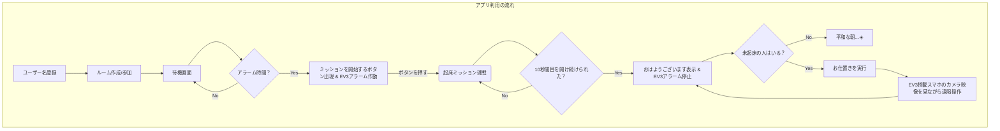
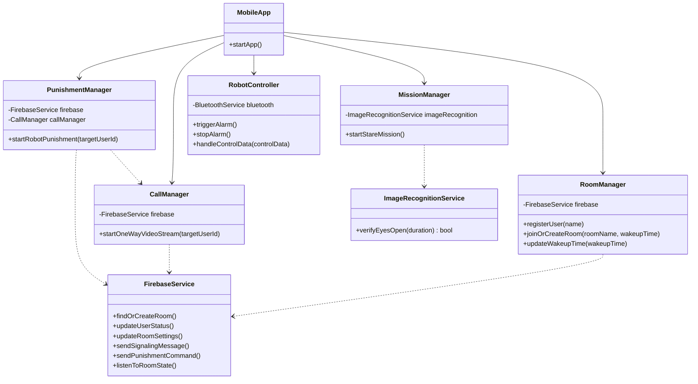
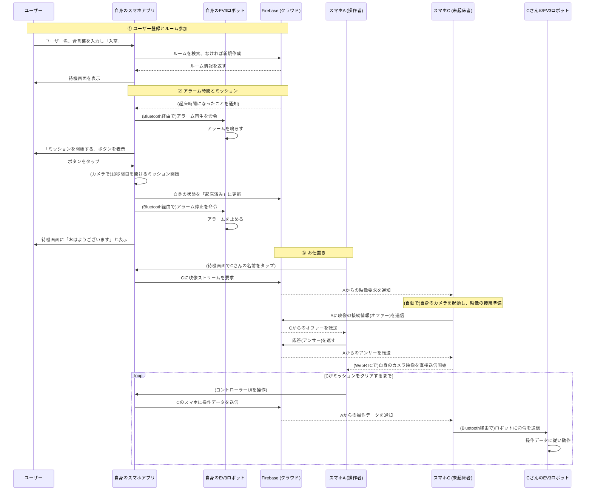
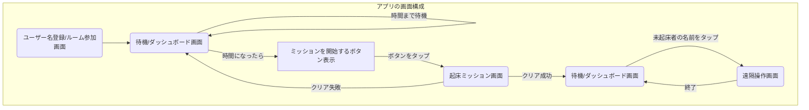

# アプリ要件定義書（完成版）

---

## 1. アプリ概要

本アプリは、複数人のグループで起床時間を設定し、時間通りに起きることを促すソーシャルな目覚ましアプリです。起床ミッションに成功しないと、他のメンバーからLEGO MINDSTORMS EV3（以下、EV3）を遠隔操作されて「お仕置き」を受けるというユニークな体験を提供します。

---

## 2. 機能要件

### 2.1. ホーム画面とルームへの参加

- **ユーザー名入力:** ホーム画面には「ユーザー名」を入力するテキストボックスを設置します。
- **ルームへの参加フロー:**
    1. ホーム画面の「ルームに入る」ボタンをタップすると、ポップアップが表示されます。
    2. ポップアップ内で「合言葉」を入力し、「入室」ボタンをタップします。
    3. **ルームの自動生成・参加:**
        - 入力された「合言葉」に紐づくルームがまだ存在しない場合、その合言葉で新しいルームが自動的に作成され、ユーザーはそこに参加します。
        - すでに誰かが参加しているルームが存在する場合、ユーザーはそのルームに参加します。
- **シームレスな体験:** ユーザーにとっては、新規作成と参加の間に画面上の違いはなく、単に「合言葉で指定された空間に入る」という体験になります。
- **ホスト・ゲストの不在:** 特定のユーザーがホストやゲストになることはありません。ルームはサーバー上のデータベースに存在する共有スペースとして機能します。

### 2.2. 待機画面 (ダッシュボード) とアラーム動作

ルームに参加後、ユーザーはこの画面で待機します。画面には以下の要素を表示します。

- **起床時間設定:** この画面でルーム全体の起床時刻を設定・変更できます。
- **残り時間:** 設定された起床時間までのカウントダウンタイマーを「HH:MM:SS」形式で表示します。
- **参加者リスト:**
    - **参加者名:** ルームに参加している全メンバーのユーザー名を表示します。
    - **起床状態:** 各メンバーの現在の状態（例：「待機中」「起床済み」「ミッション中」）を表示します。
- **時間経過による動的変化:**
    - 起床時間になると、スマートフォンアプリからBluetooth経由で信号が送られ、**接続されたEV3本体からアラーム音が鳴り始めます。**
    - 同時に、アプリの「残り時間」表示が大きな**「ミッションを開始する」**ボタンに切り替わります。
    - ミッションクリア後は、ボタンがあった場所が**「おはようございます」**というテキスト表示に変わります。

### 2.3. 起床ミッション機能

- 「ミッションを開始する」ボタンをタップすると、ミッション画面に遷移します。
- ミッション内容は「スマートフォンのインカメラを使い、10秒間目を開け続けること」とします。
- ミッションに成功すると、ユーザーのステータスが「起床済み」に更新され、待機画面に戻ります。**同時に、アプリからEV3へ停止信号が送られ、アラーム音が止まります。**

### 2.4. お仕置き（EV3遠隔操作）機能

- **操作画面への遷移:** 待機画面で、起床時間後にまだ起きていないメンバーの**名前をタップ**すると、遠隔操作画面に遷移します。
- **操作画面の構成:**
    - **カメラ映像:** 対象メンバーのEV3に搭載されたスマートフォンのカメラ映像が表示されます。
    - **操作パネル:** 相手のEV3を動かすためのバーチャルコントローラーが表示されます。
    - **お仕置きボタン:** EV3の特定のアクション（例：ハンマーを振り下ろす）を実行させるためのボタンを設置します。
- **操作対象:** ユーザーは、この画面を通じて**他人のEV3ロボットを直接操作**し、「お仕置き」を実行します。

---

## 3. システム構成案

### 3.1. フローチャート (ユーザー体験の流れ)



図の解説:

ユーザー体験の大きな流れは変わりませんが、アラーム時間になると「ミッションボタンの出現」と同時に**「EV3のアラームが作動」し、ミッションをクリアすると「アラームが停止」**する点が明確化されました。

### 3.2. クラス図 (システムの構成要素)



図の解説:

RoomManagerにupdateWakeupTime、RobotControllerにtriggerAlarmとstopAlarmといった具体的なメソッドを追加し、ダッシュボードでの時間設定変更やアラーム制御の役割を明確化しました。

### 3.3. シーケンス図 (処理の具体的な流れ)



**図の解説:**

- **アラーム & ミッション:** 起床時間になると、Firebaseからの通知を受けたアプリが、Bluetooth経由で**自身のEV3にアラーム再生を命令**します。ミッションをクリアすると、同様に**アラーム停止を命令**する流れを明記しました。
- **お仕置き:** お仕置きの開始トリガーを、ボタンのタップから**「未起床者の名前をタップ」**という操作に変更しました。

### 3.4. 通信プロトコルの解説

- **スマホ ↔ Firebaseサーバー (WebSocket):**
    - **役割:** アプリの心臓部。ルームやユーザーの状態更新、各種コマンド（通話開始、映像要求、操作データ）の送受信に使われます。ルームの起床時間設定の更新もここで行われます。
- **スマホ ↔ スマホ (WebRTC):**
    - **役割:** お仕置きの際の、ターゲットのスマホから操作者のスマホへの**一方向映像ストリーミング**に使用します。
- **スマホ ↔ EV3ロボット (Bluetooth):**
    - **役割:** スマートフォンが「ブリッジ（橋渡し）」役となり、EV3を直接制御します。
    - **具体的な通信内容:**
        - **アラーム制御:** 起床時間になった際の「アラーム再生」コマンド、ミッションクリア時の「アラーム停止」コマンド。
        - **遠隔操作:** お仕置きの際に、Firebaseから受信した操作データをリアルタイムでEV3に送信。

### 3.5. アプリ画面遷移図



図の解説:

遠隔操作画面への遷移トリガーを、より具体的な「未起床者の名前をタップ」に更新しました。

### 3.6. データベース設計 (データモデル)

本システムでは、リアルタイム性とスケーラビリティを考慮し、NoSQLデータベースである **Cloud Firestore** の利用を想定します。データは「コレクション」と「ドキュメント」の形式で管理します。

### 3.6.1. コレクション構成

主に2つのコレクションを定義します。

1. **`rooms` コレクション:** 各ルームの情報を格納します。
2. **`users` コレクション:** 各ユーザーの情報を格納します。

### 3.6.2. データ構造の詳細

**`rooms` コレクション**

- **ドキュメントID:** ユーザーが入力する「合言葉」をそのままIDとして使用します。
- **フィールド:**
    - `wakeupTime` (Timestamp): ルームで設定された起床時間
    - `createdAt` (Timestamp): ルームが最初に作成された日時

*(例: `rooms` コレクション内のドキュメント)*

```json
{
  "合言葉1234": {
    "wakeupTime": "August 20, 2024 at 7:00:00 AM UTC+9",
    "createdAt": "August 19, 2024 at 10:30:00 PM UTC+9"
  }
}
```

**`users` コレクション**

- **ドキュメントID:** Firebase Authenticationなどで発行される一意のユーザーID (`uid`) を使用します。
- **フィールド:**
    - `username` (String): ユーザーが設定した名前
    - `roomId` (String): 現在参加しているルームのID（合言葉）
    - `status` (String): ユーザーの現在の状態 (`waiting`, `mission`, `woke_up`)
    - `lastSeen` (Timestamp): ユーザーの最終アクティブ日時（オフライン判定などに使用）

*(例: `users` コレクション内のドキュメント)*

```json
{
  "abcdefg12345": {
    "username": "Taro",
    "roomId": "合言葉1234",
    "status": "waiting",
    "lastSeen": "August 20, 2024 at 6:59:00 AM UTC+9"
  },
  "hijklmn67890": {
    "username": "Hanako",
    "roomId": "合言葉1234",
    "status": "waiting",
    "lastSeen": "August 20, 2024 at 6:58:00 AM UTC+9"
  }
}
```

### 3.6.3. データ連携

- アプリは、まず `users` コレクションから自身の `roomId` を取得します。
- 次に、その `roomId` を使って `rooms` コレクションから起床時間などのルーム情報を取得します。
- 待機画面（ダッシュボード）に参加者一覧を表示する際は、`roomId` が一致するユーザーを `users` コレクションから全て検索し、`username` と `status` を表示します。
- この構成により、ユーザー情報とルーム情報を分離し、効率的なデータの読み書きを実現します。